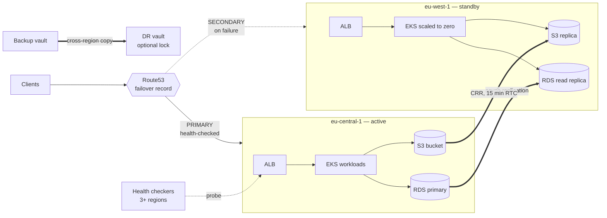

# aws-multi-region-dr

Active-passive multi-region disaster recovery on AWS, as Terraform plus the runbooks that make it real: Route53 health-check failover, S3 cross-region replication, an RDS cross-region replica, and AWS Backup copying into the standby region.

**RTO 30 minutes · RPO 5 minutes.** Both numbers are measured by alarms in this repo rather than asserted — see [RTO and RPO](docs/rto-rpo.md).

---

## Architecture



Warm standby: infrastructure exists and data replicates continuously, but the application runs at zero replicas until failover. That is the tradeoff — an idle standby costs a fraction of an active-active setup and recovers in minutes rather than hours.

---

## What each piece does

| Component | Role in a disaster |
| --- | --- |
| **Route53 failover** | Health checkers in 3+ regions probe a deep endpoint. Three failures at 30s intervals flips DNS to the standby, roughly 90s to detect. |
| **RDS cross-region replica** | Continuous async replication. Promoted during failover — this is the irreversible step. `ReplicaLag` **is** the RPO measurement. |
| **S3 replication** | Replication Time Control puts a 15-minute SLA on object replication and, more usefully, emits the metrics that make lag visible. |
| **AWS Backup** | Scheduled backups copied cross-region, with optional compliance-mode vault lock. This is the layer that survives operator error and ransomware, which regional replication does not. |

---

## Decisions worth knowing about

**The health check probes a deep endpoint, not `/`.** A `/` that returns 200 while the database is unreachable is precisely the failure DNS failover is meant to catch and won't.

**The health check targets a region-specific hostname, never the failover record.** Pointing a health check at the record it controls is a feedback loop that fails in ways that are genuinely hard to debug at 3am.

**The SECONDARY record has no health check attached.** When every record in a failover set is unhealthy, Route53 returns the primary anyway. Health-checking the secondary buys nothing in a total outage and can cause a needless flip during a partial one.

**S3 delete markers do not replicate.** A delete in the primary must not silently destroy the DR copy. That is the difference between a replica and a backup.

**Replication alarms treat missing data as breaching.** No data from a replication metric usually means replication has stopped, which is exactly when you need to know.

---

## Usage

```hcl
module "dr" {
  source = "github.com/favy12/aws-multi-region-dr"

  name             = "platform"
  primary_region   = "eu-central-1"
  secondary_region = "eu-west-1"

  hosted_zone_id = "Z1234567890ABC"
  record_name    = "app.example.com"

  primary_alias_name    = aws_lb.primary.dns_name
  primary_alias_zone_id = aws_lb.primary.zone_id

  secondary_alias_name    = aws_lb.standby.dns_name
  secondary_alias_zone_id = aws_lb.standby.zone_id

  primary_health_check_fqdn   = "eu-central-1.example.com"
  secondary_health_check_fqdn = "eu-west-1.example.com"

  source_bucket_id        = aws_s3_bucket.app.id
  source_bucket_arn       = aws_s3_bucket.app.arn
  source_kms_key_arn      = aws_kms_key.app.arn
  destination_bucket_name = "platform-dr-replica"

  source_db_arn        = aws_db_instance.primary.arn
  secondary_vpc_id     = module.standby_network.vpc_id
  secondary_subnet_ids = module.standby_network.private_subnet_ids

  alarm_sns_topic_arns = [aws_sns_topic.oncall.arn]
}
```

Three provider aliases are required: `primary`, `secondary`, and `us_east_1` — the last because Route53 health check metrics are only published there, regardless of where the workload runs.

---

## Runbooks

The Terraform is maybe half of what makes DR work. These are the other half:

- **[failover.md](runbooks/failover.md)** — the 30-minute path, with a decision gate on when *not* to fail over
- **[failback.md](runbooks/failback.md)** — the harder direction, and why it needs its own window
- **[game-day.md](runbooks/game-day.md)** — quarterly exercise, roles, injected failures, findings table

The failover runbook is written for someone woken at 3am who did not build this. That constraint is why every step has an expected duration and every irreversible step says so in bold.

---

## Cost

Rough monthly figures for a warm standby, eu-central-1 → eu-west-1:

| | Monthly |
| --- | --- |
| RDS replica (`db.r6g.large`, single-AZ) | ~$190 |
| Standby EKS control plane + minimal nodes | ~$150 |
| S3 replication (RTC, 500 GB/mo change) | ~$25 |
| Cross-region transfer | ~$20 per 1 TB |
| Route53 health checks | ~$2 |
| Backup storage and copies | varies |
| **Baseline** | **~$400** |

Roughly 20–30% of the primary's cost. The levers: `replica_multi_az = false` in the standby (halves the replica cost, accepts an AZ failure during failover), and turning off RTC if 15-minute object replication is not required.

If that is still too much, the honest alternatives are backup-and-restore DR (RTO in hours, far cheaper) or accepting a single-region RPO. What does not work is claiming 30-minute RTO while funding a backup-restore architecture.

---

## Verification

```bash
terraform fmt -check -recursive
terraform init -backend=false && terraform validate
tflint --recursive
trivy config .
```

CI runs all four on every PR.

The verification that matters, though, is the game day. Everything here is a hypothesis until a failover has been executed under time pressure by someone who did not write it.

---

## License

MIT — see [LICENSE](LICENSE).
